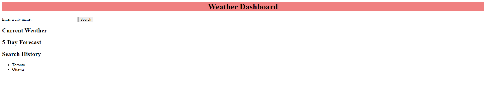

# Kajian Weather Dashboard
Website Made by Kajian Pulenthirasingam

My first Weather dashboard. I had the challenge of making my first weather dashboard. Enter the city for the current weather and its 5 day forecast. It will tell you the weather condition with pictures. There is a search history option on the bottom of the page that tells you what you have searched before. I used the https://openweathermap.org/forecast5 to get the API key to make this code function. For installing my project you just need to clone this code to your repository. Project by Kajian Pulenthirasingam

The link to the project: https://kajianpulenthirasingam.github.io/weather-dashboard/
The link to the repository: https://github.com/kajianpulenthirasingam/weather-dashboard

